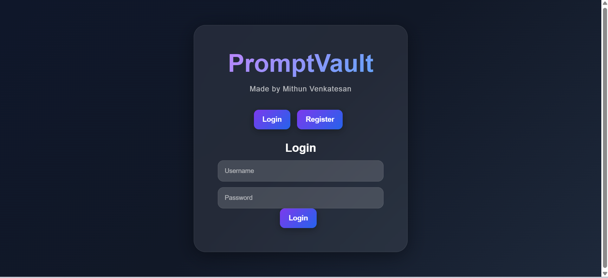
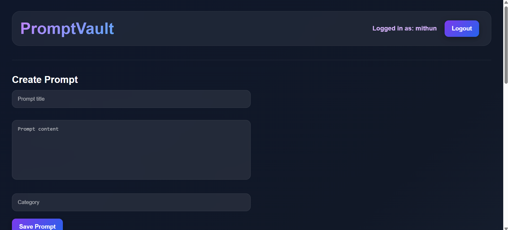
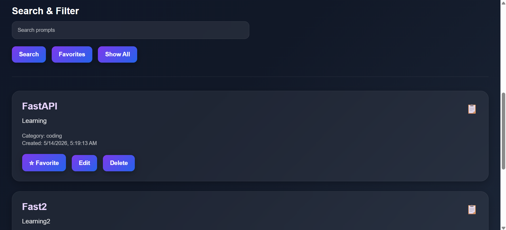

# PromptVault – Full Stack AI Prompt Manager

PromptVault is a modern full-stack web application built using FastAPI that allows users to securely save, organize, search, and manage AI prompts.

The application includes JWT authentication, secure password hashing, user-specific prompt storage, favorites system, and a responsive modern UI.

---

# Live Demo

[Live Demo](https://promptvault-fastapi-1.onrender.com/)

---

# GitHub Repository

[GitHub Repo](https://github.com/Mithun-Newt/promptvault-fastapi.git)

---

# Features

- User Registration & Login
- JWT Authentication
- Secure Password Hashing using Argon2
- User-specific Prompt Management
- Create / Edit / Delete Prompts
- Favorite Prompts
- Search & Filter Functionality
- Copy Prompt to Clipboard
- Responsive Modern UI
- Protected API Routes
- Public Deployment using Render

---

# Tech Stack

## Backend

- FastAPI
- SQLAlchemy
- SQLite
- JWT Authentication
- Pydantic

## Frontend

- HTML
- CSS
- Vanilla JavaScript

## Deployment

- Render

---

# Screenshots

## Authentication Page



---

## Dashboard



---

## Prompt Management



---

# Installation

## Clone Repository

```bash
git clone YOUR_GITHUB_REPO_LINK
```

---

## Navigate to Project Folder

```bash
cd promptvault-fastapi
```

---

## Install Dependencies

```bash
pip install -r requirements.txt
```

---

## Run Server

```bash
uvicorn main:app --reload
```

---

# API Documentation

FastAPI Swagger Docs:

```text
http://127.0.0.1:8000/docs
```

---

# Project Structure

```text
promptvault-fastapi/
│
├── routers/
│   ├── auth.py
│   └── prompts.py
│
├── static/
│   ├── style.css
│   └── app.js
│
├── templates/
│   └── home.html
│
├── screenshots/
│   ├── auth-page.png
│   ├── dashboard.png
│   └── prompts.png
│
├── database.py
├── models.py
├── schemas.py
├── security.py
├── render.yaml
├── requirements.txt
├── main.py
└── README.md
```

---

# Authentication Flow

- User registers account
- Password hashed securely using Argon2
- User logs in
- JWT token generated
- Token stored in browser localStorage
- Protected routes accessed using Bearer token

---

# Deployment

The application is publicly deployed using Render.

Deployment included:
- dependency management
- Python 3.14 compatibility fixes
- pydantic compatibility resolution
- production server setup

---

# Future Improvements

- PostgreSQL Integration
- Docker Support
- React Frontend
- Redis Caching
- AI Prompt Suggestions
- Prompt Tags & Categories
- Dark / Light Theme Toggle
- OAuth Login

---

# Author

Made by Mithun Venkatesan